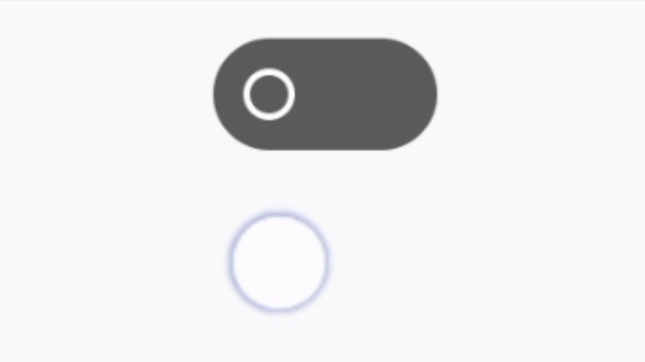
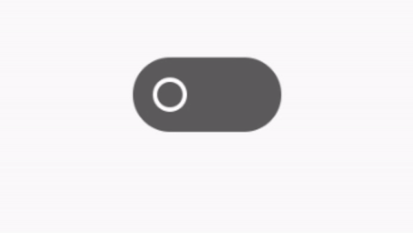

## Custom Switch View  [](https://jitpack.io/#juan-goncalves/blloc-switch-view) 
Custom lightweight switch for Android applications.

<p align="center">

</p>

#### Features

| Feature        | Example           |
| ------------- |:-------------:|
|Draggable state indicator|  |
|Switch state snapping after finishing a drag motion| |
|Customizable background color|-|
|Allow toggling and setting the switch state programmatically|-|

#### Usage

1. Add the JitPack repository to your build file
```
allprojects {
	repositories {
		...
		maven { url 'https://jitpack.io' }
	}
}
```
3. Add the library as a dependency in your project
`implementation 'me.juangoncalves.blloc.switchview:1.0.0'`

4. Use the `BllocSwitchView` class in your layouts
```
  ...
  
  <me.juangoncalves.switchview.BllocSwitchView  
	  android:id="@+id/bllocSwitch"  
	  android:layout_width="wrap_content"  
	  android:layout_height="wrap_content" />
	  
  ...
  ```
